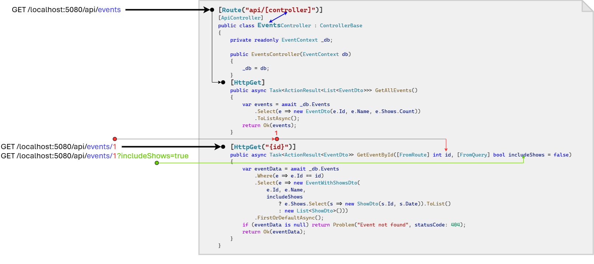
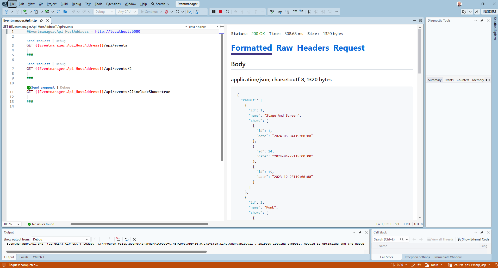

= Controller in ASP.NET Core: GET Routen
:source-highlighter: rouge
:icons: font
:lang: DE
:hyphens:
ifndef::env-github[:icons: font]
ifdef::env-github[]
:caution-caption: :fire:
:important-caption: :exclamation:
:note-caption: :paperclip:
:tip-caption: :bulb:
:warning-caption: :warning:
endif::[]

image::../events_0716.svg[]

NOTE: Link zum Programm: link:../Eventmanager[Eventmanager]

== Zusammenspiel zwischen Routing und Controller

Wie im Kapitel RESTful APIs beschrieben, werden Ressourcen über URLs (Uniform Resource Locators) eindeutig identifiziert.
Die Grundprinzipien bei der Gestaltung von RESTful URLs sind

* *Ressourcenorientiert:* Die URL steht für eine Ressource, nicht für eine Aktion.
  Deswegen bestehen sie auch aus Substantiven (Hauptwörtern), nicht aus Verben.
  Richtig: _/api/timetables_
  Falsch: _/api/getTimetable_

* *Hierarchie & Struktur:* Die URL verwendet hierarchische Pfade zur Darstellung von Zusammenhängen.
  _/api/customers/123/orders_ gibt die Bestellungen des Kunden mit der ID _123_ an.

* *Pluralisierung:* Verwende konsistent Pluralformen für Ressourcen, also _/api/customers_ statt _/api/customer_.

Aufgabe des _Routing Systems_ von ASP.NET Core ist es, den URLs entsprechenden Programmcode zuzuordnen.
Dabei werden 2 Ansätze angeboten:

* Minimal API
* Controller-based API

Die _Minimal API_ richtet sich an Entwickler, die Erfahrung mit dem Express Paket von Node.js oder Flask aus dem Python Ökosystem haben und wenige Endpunkte z. B. für ein Microservice anbieten möchten.
Auf https://learn.microsoft.com/en-us/aspnet/core/tutorials/min-web-api gibt es eine genaue Beschreibung.

Wir werden allerdings den Ansatz mit *Controllerklassen* wählen.
Bei größeren Projekten fällt es leichter, den Code thematisch zu trennen und merge Konflikte zu reduzieren.

== Der Controller in ASP.NET Core

Ein Controller ist - syntaktisch betrachtet - eine "normale" C# Klasse mit Attributes.
Die Attributes steuern, welche URL welcher Methode zugeordnet wird.

In der Datei _Program.cs_ haben wir bereits beim Anlegen des Projektes die Grundlagen geschaffen, dass ASP.NET Core diese Verknüpfung herstellen kann:

[source,csharp]
----
// STEP 1: Configuring ASP.NET Core Services
var builder = WebApplication.CreateBuilder(args);
builder.Services.AddControllers();
// ....
// STEP 2: Configuring ASP.NET Core request pipeline
var app = builder.Build();
app.MapControllers();
// ....
app.Run();
----

Die Methode _AddControllers()_ durchsucht alle Klassen mit den Attribute _[ApiController]_ und baut sich das Adressmapping auf.
_MapControllers()_ sorgt dafür, dass der Request durch die Methode im Controller abgearbeitet wird.

[NOTE]
Fehlt einer dieser Teile, wird ASP.NET Core die Adressen nicht zuordnen können und es wird _404 not found_ geliefert.

Zuerst legen wir im _Application Projekt_ einen Ordner _Dtos_ an und definieren 3 DTO Klassen.
Sie geben an, welche Informationen wir zurückgeben wollen.

[source,csharp]
----
public record EventDto(int Id, string Name, int ShowsCount);
public record EventWithShowsDto(int Id, string Name, List<ShowDto> Shows);
public record ShowDto(int Id, DateTime Date);
----

Nun wollen wir im _API Projekt_ einen ersten Controller anlegen:

.Eventmanager.Api/Controllers/EventsController.cs
[source,csharp]
----
using Eventmanager.Application.Dtos;
using Eventmanager.Infrastructure;
using Microsoft.AspNetCore.Http;
using Microsoft.AspNetCore.Mvc;
using Microsoft.EntityFrameworkCore;
using System.Collections.Generic;
using System.Linq;
using System.Threading.Tasks;

namespace Eventmanager.Api.Controllers;

[Route("api/[controller]")]
[ApiController]
public class EventsController : ControllerBase
{
    private readonly EventContext _db;

    public EventsController(EventContext db)
    {
        _db = db;
    }
    [HttpGet]
    [ProducesResponseType<List<EventDto>>(StatusCodes.Status200OK)]
    public async Task<ActionResult<List<EventDto>>> GetAllEvents()
    {
        var events = await _db.Events
            .Select(e => new EventDto(e.Id, e.Name, e.Shows.Count))
            .ToListAsync();
        return Ok(events);
    }

    [HttpGet("{id}")]
    [ProducesResponseType<EventDto>(StatusCodes.Status200OK)]
    [ProducesResponseType(StatusCodes.Status404NotFound)]
    public async Task<ActionResult<EventDto>> GetEventById(
        [FromRoute] int id,
        [FromQuery] bool includeShows = false)
    {
        var eventData = await _db.Events
            .Where(e => e.Id == id)
            .Select(e => new EventWithShowsDto(
                e.Id, e.Name,
                includeShows
                    ? e.Shows.Select(s => new ShowDto(s.Id, s.Date)).ToList()
                    : new List<ShowDto>()))
            .FirstOrDefaultAsync();
        if (eventData is null) return Problem("Event not found", statusCode: 404);
        return Ok(eventData);
    }
}
----

Wir sehen 3 Attributes:

* Route
* ApiController
* HttpGet

Das Attribute *_Route_* weist die _Basisadresse_ für die Controllerklasse zu.
Wir können z. B. _[Route("api/events")]_ schreiben, wenn der Controller auf Adressen, die mit _api/events_ beginnen, hören soll.
Damit wir allerdings flexibler sind, können wir statt _[Route("api/events")]_ auch _[Route("api/[controller]")]_ schreiben.
Hier wird der Name aus dem Namen der Controllerklasse extrahiert.
_EventsController_ ordnet die Basisadresse _api/events_ zu, _TimetablesController_ die Adresse _api/timetables_, etc.

Auf Methodenebene kommt das Attribute *_HttpGet_* zum Einsatz.
Ohne weitere Parameter wird es auf _GET_ Requests an die Adresse des Controllers reagieren.
Damit wir weitere IDs in der Adresse angeben können, schreiben wir z. B. _[HttpGet("{id}")]_
Es wird den Wert nach _events_ auslesen und in der Variable _id_ bereitstellen.

[NOTE]
Achte darauf, dass der Parameter von _HttpGet_ genau dem Parameternamen der Methode entspricht (case sensitive)!

Die folgende Grafik zeigt die Zuordnung verschiedener Adressen.

== Dependency Injection

Eine Besonderheit von ASP.NET Core ist die Unterstützung von _Dependency Injection_.
Anstatt den Datenbankcontext im Controller mit _new_ zu instanzieren und zu konfigurieren, haben wir eine flexiblere Möglichkeit.
Der _Serviceprovider_ ist dafür zuständig, Instanzen von registrierten Typen zu erzeugen.
In der Datei _Program.cs_ haben wir mit _AddDbContext<T>()_ eine solche "Anleitung" an den Serviceprovider gegeben, wie eine Instanz der Klasse _EventContext_ zu erzeugen ist.

[source,csharp]
----
// Configure Datebase with settings from appsettings.json (section ConnectionStrings)
builder.Services.AddDbContext<EventContext>(options => 
    options.UseSqlite(builder.Configuration.GetConnectionString("Default")));
----

Nun können wir in unserem Controller einfach im Konstruktor den Typ _EventContext_ anfordern.
ASP.NET Core wird bei jedem Request eine Instanz nach dieser Vorschrift erzeugen und sie dem Controller übergeben.

=== Die Klassen _Task_ und _ActionResult_

Bisher haben wir die Datenbank _blockierend_ mit _ToList()_, _FirstOrDefault()_ abgefragt.
Besser ist es, wenn der Webserver, während er auf die Antwort der Datenbank wartet, in der Zwischenzeit andere Requests annimmt.
Deswegen gibt es in C# - wie in Javascript - das Konzept der _Tasks_ (in Javascript: Promise).
Die Regeln sind fast ident mit Javascript, wenn man _Promise_ durch _Task_ ersetzt:

* Wird _await_ verwendet, muss die Methode _async_ sein.
* Der Rückgabewert einer _async_ Methode ist _Task<T>_.
* Die Methoden _ToListAsync()_ und _FirstOrDefaultAsync()_ geben einen Task zurück, auf den gewartet werden kann.

Der Rückgabewert der Controllermethode ist daher einmal _Task<T>_.
_T_ ist wieder ein generischer Typ mit dem Namen _ActionResult_.
Ein _ActionResult_ ist eine Kombination von _StatusCode_ und den Daten.
Mit _Ok(data)_ wird ein ActionResult mit Status Code _200 OK_ und den übergebenen Daten zurückgegeben.
Möchten wir Fehlermeldungen zurückgeben, verwenden wir die Methode _Problem(message, statusCode: code)_.

== Erstellen eines HTTP Files zum Testen des Controllers

Wir erstellen nun eine Datei _Eventmanager.Api.http_ mit folgendem Inhalt:

.Eventmanager.Api/Eventmanager.Api.http
----
@baseUrl = http://localhost:5080

GET {{baseUrl}}/api/events

###

GET {{baseUrl}}/api/events/2

###

# Request should fail (404 not found)
GET {{baseUrl}}/api/events/999

###

GET {{baseUrl}}/api/events/2?includeShows=true

###
----

Öffnen wir diese Datei in Visual Studio, können wir mit _Send request_ einen Request an diese Adresse senden.
Dafür starten wir zuerst die Applikation und klicken danach auf _Send request_.

[TIP]
Unter _View_ -> _Other Windows_ -> _Endpoints Explorer_ können diese Einträge automatisch erstellt werden.

*Weitere Informationen:* https://learn.microsoft.com/en-us/aspnet/core/tutorials/first-web-api

== Übung

Erstelle wie im Kapitel _"Die erste ASP.NET Core App"_ eine .NET 10 Application und ein .NET 10 API Projekt.
Nutze dafür die dort beschriebenen _dotnet_ Kommandos.
Die Projekte sollen _Fitnesscenter.Application_ und _Fitnesscenter.Api_ heißen.
Die Solution _Fitnesscenter.sln_ soll sich im Ordner _AspLab01_ befinden.
Kopiere danach die Modelklassen und den DbContext aus der Datei link:Fitnesscenter.Model.7z[Fitnesscenter.Model.7z] in das Application Projekt.
Die Projektstruktur soll danach so aussehen:

----
📁 AspLab01
    📁 Fitnesscenter.Application
        📁 Infrastructure
            🗎 FitnessContext.cs
        📁 Model
            🗎 Member.cs
            🗎 Participation.cs
            🗎 Room.cs
            🗎 Trainer.cs
            🗎 TrainingSession.cs
            🗎 Visit.cs
        🗎 Fitnesscenter.Application.csproj
    📁 Fitnesscenter.Api
        📁 Controllers
            🗎 MembersController.cs
        📁 Properties
            🗎 launchSettings.json
        🗎 appsettings.json
        🗎 Fitnesscenter.Api.csproj
        🗎 Program.cs
    🗎 Fitnesscenter.sln
----

Das Klassendiagramm der Modelklassen ist hier dargestellt:

image::../fitness_2059.svg[]

Erstelle nun einen Controller, der auf _/api/members_ reagieren soll.
Er soll 3 Endpunkte anbieten.

=== GET /api/members?onlyActive=(true|false)

Liefert eine Liste aller Members.
Ist der Query Parameter _onlyActive_ auf true gesetzt, sollen nur die Members geliefert werden, dessen Wert _Member.IsActive_ _true_ ist.
Ansonsten sollen alle Members geliefert werden.

Erstelle eine DTO Klasse, die folgende JSON Antwort der API liefert (Beispielwerte):

[source,json]
----
[
    {
        "id": 9999, "firstName": "string", "lastName": "string", "email": "string",
        "isActive": true, "visitsCount": 9999, "participationCount": 9999
    },
    ....
]
----

=== GET /api/members/{id}

Liefert die Detaildaten eines Members inklusive der Visits. 
Erstelle eine DTO Klasse, die folgende JSON Antwort der API liefert (Beispielwerte):

[source,json]
----
{
    "id": 9999, "firstName": "string", "lastName": "string", "email": "string",
    "membershipType": "string", "activeSince": "string", "isActive": true,
    "visits": 
    [
        { "start": "string", "end": "string" },
        ...
    ]
}
----

Wird die ID nicht gefunden, soll _404 not found_ mit der Detailinfo "Member not found." zurückgegeben werden.

[NOTE]
_DateTime_ Werte werden automatisch beim Erzeugen der JSON Antwort in einen String umgewandelt. 
Definiere sie daher in der DTO Klasse als _DateTime_.

=== GET /api/members/{id}/participations

Liefert eine Liste aller Participations (Teilnahme an Trainingseinheiten), die das Mitglied gebucht hat.
Erstelle eine DTO Klasse, die folgende JSON Antwort der API liefert (Beispielwerte):

[source,json]
----
{
    "trainerId": 9999, "trainerFirstName": "string", "trainerLastName": "string",
    "roomName": "string", "time": "string", "type": "string", "duration": 9999,
    "rating": 9999
}
----

Die Werte für _roomName_, _time_, _type_ und _duration_ stehen in der Modelklasse _TrainingSession_ bzw. _Room_.
Frage sie über die Navigation Participation -> TrainingSession -> Room ab.
Die Werte für _trainerId_, _trainerFirstName_ und _trainerLastName_ stehen in der Modelklasse _Trainer_.
Frage sie über die Navigation Participation -> TrainingSession -> Trainer ab.

Wird die ID nicht gefunden, soll _404 not found_ mit der Detailinfo "Member not found." zurückgegeben werden.

=== Erstellen eines HTTP Files

Erstelle ein HTTP File mit dem Namen _Fitnesscenter.Api.http_.
Es sollen die folgenden Endpunkte getestet werden:

* GET /api/members?onlyActive=true
* GET /api/members?onlyActive=false
* GET /api/members/999
* GET /api/members/1
* GET /api/members/999/participations
* GET /api/members/1/participations

Die Endpunkte mit der ID _999_ sollen _404 not found_ liefern, die anderen Endpunkte _200 OK_ mit den entsprechenden JSON Daten.
