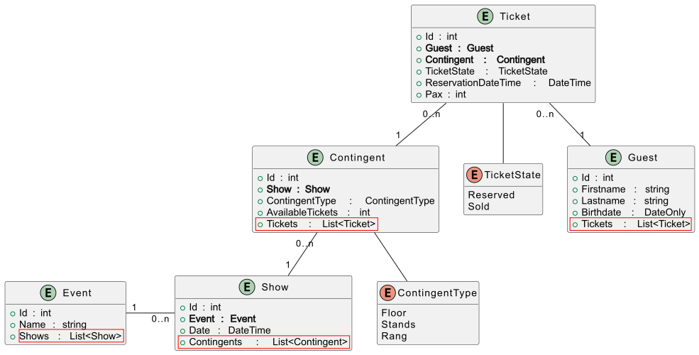
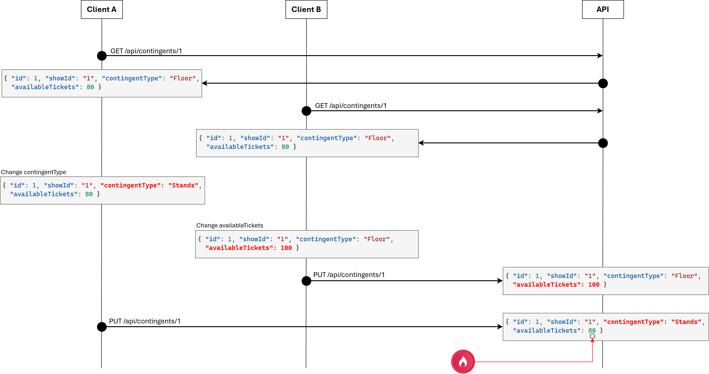
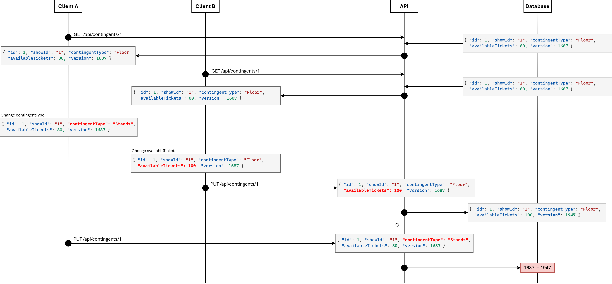
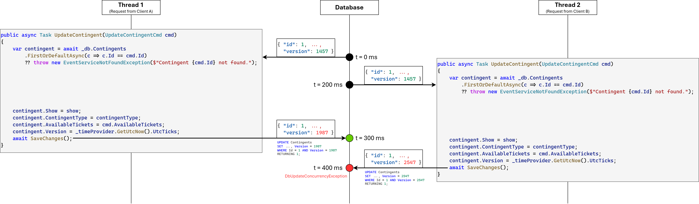

= PUT, PATCH und DELETE
:source-highlighter: rouge
:icons: font
:lang: DE
:hyphens:
ifndef::env-github[:icons: font]
ifdef::env-github[]
:caution-caption: :fire:
:important-caption: :exclamation:
:note-caption: :paperclip:
:tip-caption: :bulb:
:warning-caption: :warning:
endif::[]

NOTE: Link zum Programm: link:../Eventmanager[Eventmanager]

== Der Time Provider

Wie bei der letzten Übung kommt auch hier der Time Provider zum Einsatz.
Er wird in der Datei _Program.cs_ als _singleton service_ registriert.

[source,csharp]
----
builder.Services.AddSingleton<TimeProvider>((provider) => TimeProvider.System);
----

Im Service können wir mit _GetLocalNow()_ bzw. _GetUtcNow()_ die Systemzeit abrufen.
Im Unittest können wir die Klasse _FakeTimeProvider_ aus dem NuGet Paket _Microsoft.Extensions.TimeProvider.Testing_ nutzen.
Sie leitet sich von _TimeProvider_ ab, und kann daher dem Service statt dem "echten" Time Provider übergeben werden.
In diesem Beispiel wird die aktuelle Systemzeit auf den 28.2.2026 um 14:30 UTC (Offset = 0) gesetzt.

[source,csharp]
----
[Fact]
public void FakeTimeTest()
{
    // NuGet: Install Microsoft.Extensions.TimeProvider.Testing
    var timeProvider = new FakeTimeProvider(
        new DateTimeOffset(2026, 2, 28, 14, 30, 0, TimeSpan.Zero));
    var service = new EventService(db, timeProvider, isDevelopment: true);
}
----

== Ressourcen ersetzen mit PUT

Technisch gesehen ist die Verarbeitung eines PUT Requests nicht schwer.
Die benötigten Komponenten wie Command Object, Servicemethode und Endpunkt sind wie beim POST Request nötig und unterscheiden sich nur wenig.

=== Command Object und Servicemethode

Zuerst legen wir im Application Projekt einen record _UpdateContingentCmd_ an.
Natürlich muss er die Validierungsregeln, wie sie auch beim Anlegen eines Kontingentes gelten, beinhalten.
Neu ist das Property _Id_.
Da wir eine bestehende Ressource aktualisieren, brauchen wir eine eindeutige Identifikation.
Das Property _Version_ wird später besprochen. Es verhindert, dass Änderungen anderer User überschrieben werden.

.link:../Eventmanager/Eventmanager.Application/Commands/UpdateContingentCmd.cs[Eventmanager.Application/Commands/UpdateContingentCmd.cs]
[source,csharp]
----
using Eventmanager.Model;
using System;
using System.Collections.Generic;
using System.ComponentModel.DataAnnotations;

namespace Eventmanager.Application.Commands;

public record UpdateContingentCmd(
    [Range(1,int.MaxValue, ErrorMessage = "Invalid id.")]
    int Id,
    [Range(1,int.MaxValue, ErrorMessage = "Invalid show id.")]
    int ShowId,
    [StringLength(255, MinimumLength = 1, ErrorMessage = "Invalid contingent type.")]
    string ContingentType,
    [Range(1,9999)]
    int AvailableTickets,
    long Version) : IValidatableObject
{
    public IEnumerable<ValidationResult> Validate(ValidationContext validationContext)
    {
        if (!Enum.IsDefined(typeof(ContingentType), ContingentType))
        {
            yield return new ValidationResult(
                "Invalid value for contingent type",
                new string[] { nameof(ContingentType) });
        }
    }
}
----

Das Service wird durch eine Methode _UpdateContingent_ ergänzt.

.link:../Eventmanager/Eventmanager.Application/Services/EventService.cs[Eventmanager.Application/Services/EventService.cs]
[source,csharp]
----
public class EventService(EventContext db, bool isDevelopment, TimeProvider timeProvider) : IEventService
{
    // ....

    public async Task UpdateContingent(UpdateContingentCmd cmd)
    {
        if (!Enum.TryParse<ContingentType>(cmd.ContingentType, ignoreCase: true, out var contingentType))
            throw new EventServiceException($"{cmd.ContingentType} is not a valid contingent type.");

        var contingent = await db.Contingents
            .FirstOrDefaultAsync(c => c.Id == cmd.Id)
            ?? throw new EventServiceNotFoundException($"Contingent {cmd.Id} not found.");

        if (contingent.Version != cmd.Version)
            throw new EventServiceException($"The contingent has already changed.");

        var show = await db.Shows
            .FirstOrDefaultAsync(s => s.Id == cmd.ShowId)
            ?? throw new EventServiceException($"Show {cmd.ShowId} not found.");

        contingent.Show = show;
        contingent.ContingentType = contingentType;
        contingent.AvailableTickets = cmd.AvailableTickets;
        contingent.Version = timeProvider.GetTimestamp();
        // UPDATE "Contingents" SET "AvailableTickets" = 80, "ContingentType" = Floor, "Version" = 639080503086892609
        // WHERE "Id" = 1 AND "Version" = 0
        // RETURNING 1;
        await SaveChanges();
    }

    private async Task SaveChanges()
    {
        try
        {
            await db.SaveChangesAsync();
        }
        catch (DbUpdateConcurrencyException e)
        {
            var message = isDevelopment ? e.InnerException?.Message ?? e.Message : "The record has already changed.";
            throw new EventServiceException(message);
        }
        catch (DbUpdateException e)
        {
            var message = isDevelopment ? e.InnerException?.Message ?? e.Message : "Cannot write changes to database.";
            throw new EventServiceException(message);
        }
    }
}
----

==== Die EventServiceNotFoundException

Wenn die ID nicht in der Datenbank gefunden wurde, soll unser Controller den HTTP Status 404 not found liefern.
Bei anderen Fehlern soll HTTP 400 bad request zurückgegeben werden.
Damit der Controller die Exceptions unterscheiden kann, legen wir einfach eine Klasse _EventServiceNotFoundException_ an, die von _EventServiceException_ erbt.

.link:../Eventmanager/Eventmanager.Application/Services/EventServiceNotFoundException.cs[Eventmanager.Application/Services/EventServiceNotFoundException.cs]
[source,csharp]
----
[Serializable]
public class EventServiceNotFoundException : EventServiceException
{
    public EventServiceNotFoundException() { }
    public EventServiceNotFoundException(string? message) : base(message) { }
    public EventServiceNotFoundException(string? message, Exception? innerException) : base(message, innerException) { }
}
----

Somit kann die folgende Anweisung dem Controller signalisieren, dass er HTTP 404 not found zurückgeben soll:

[source,csharp]
----
var contingent = await _db.Contingents
    .FirstOrDefaultAsync(c => c.Id == cmd.Id)
    ?? throw new EventServiceNotFoundException($"Contingent {cmd.Id} not found.");
----

==== Concurrency

In der Methode _UpdateContingent_ befindet sich eine if Abfrage:

[source,csharp]
----
if (contingent.Version != cmd.Version)
    throw new EventServiceException($"The contingent has already changed.");
----

Um sie zu verstehen, müssen wir folgenden Fall analysieren:
Was passiert, wenn Client A mit einem GET Request das Kontingent lädt und einige Zeit nachher den PUT Request absetzt.
Nach dem Laden von Client A lädt Client B ebenfalls mit einem GET Request das Kontingent.
Da Client A noch nicht geschrieben hat, bekommt Client B noch die alte Version.
Nun führen beide Änderungen durch.

Dieses Verhalten bezeichnet man als _last one wins_.
Nun kommt die Version ins Spiel.
Wir ergänzen in der Modelklasse _Contingent_ ein _long_ Property mit dem Namen _Version_.

[source,csharp]
----
public class Contingent
{
    // EF Core constructor, public constructor
    public int Id { get; set; }
    public Show Show { get; set; }
    public ContingentType ContingentType { get; set; }
    public int AvailableTickets { get; set; }
    [ConcurrencyCheck]
    public long Version { get; set; }
    [JsonIgnore]
    public List<Ticket> Tickets { get; set; } = new();
}
----

Wie wir die Version nutzen können, beschreibt die folgende Grafik:

Die if Abfrage verhindert also, dass eine geänderte, alte Version eine neuere Version in der Datenbank überschreibt.

==== Optimistic locking

Die Prüfung im Servicelayer ist allerdings noch nicht ausreichend.
Es könnte auch sein, dass zwischen dem Lesen des Datensatzes in der Methode _UpdateContingent_ und dem Absetzen des _UPDATE_ Statements ein anderer Thread die Datenbank in der Zwischenzeit geändert hat.
Da die Datenbank den Datensatz zwischen dem Lesen und dem Aktualisieren nicht sperrt, bezeichnet man dieses Verhalten als _optimistic locking_.
Die folgende Grafik zeigt das Problem, das dabei auftreten kann:

Das Attribut _ConcurrencyCheck_ in EF Core verfolgt eine einfache, aber wirksame Idee:
Beim _UPDATE_ Statement wird in der _WHERE_ Klausel nicht nur die ID, sondern auch die Version angegeben.
Hat der Datensatz in der Zwischenheit eine andere Version, wird dieser nicht gefunden.
EF Core liefert dann eine _DbUpdateConcurrencyException_.
In unserer verbesserten Methode _SaveChanges_ im Service können wir darauf reagieren:

[source,csharp]
----
private async Task SaveChanges()
{
    try
    {
        await db.SaveChangesAsync();
    }
    catch (DbUpdateConcurrencyException e)
    {
        var message = _isDevelopment ? e.InnerException?.Message ?? e.Message : "The record has already changed.";
        throw new EventServiceException(message);
    }
    catch (DbUpdateException e)
    {
        var message = _isDevelopment ? e.InnerException?.Message ?? e.Message : "Cannot write changes to database.";
        throw new EventServiceException(message);
    }
}
----

=== Der PUT Endpunkt im Controller

Nach diesen vielen Vorüberlegungen ist der Controller der einfachste Teil der Implementierung.
Er ruft einfach die Servicemethode auf und liefert je nach Fehler die entsprechende Antwort.
Im Erfolgsfall wird _204 no content_ geliefert, da der Client schon alle Informationen über die Ressource besitzt.
Deswegen muss der Server keine Daten zurückliefern.

.link:../Eventmanager/Eventmanager.Api/Controllers/ContingentsController.cs[Eventmanager.Api/Controllers/ContingentsController.cs]
[source,csharp]
----
[Route("api/[controller]")]
[ApiController]
public class ContingentsController(IEventService eventService) : ControllerBase
{
    /* ... */

    [HttpPut("{id}")]
    [ProducesResponseType(StatusCodes.Status204NoContent)]
    [ProducesResponseType(StatusCodes.Status400BadRequest)]
    [ProducesResponseType(StatusCodes.Status404NotFound)]
    public async Task<IActionResult> UpdateContingent([FromRoute] int id, [FromBody] UpdateContingentCmd cmd)
    {
        if (id != cmd.Id) return Problem("Invalid id.", statusCode: 400);
        try
        {
            await eventService.UpdateContingent(cmd);
            return NoContent();
        }
        catch (EventServiceNotFoundException e)
        {
            return Problem(e.Message, statusCode: 404);
        }
        catch (EventServiceException e)
        {
            return Problem(e.Message, statusCode: 400);
        }
    }
}
----

== Teilweises Aktualisieren mit PATCH

Wir haben gesehen, dass das Aktualisieren der gesamten Resource durch die mögliche Parallelität Probleme bereiten kann.
Kommt in der Business Logik eine Aktualisierung eines einzigen Feldes häufiger vor, lohnt es sich, eine _PATCH_ Route zu implementieren.

Wir möchten einen Endpunkt _PATCH /api/contingents/availableTickets_ anbieten.
Er soll den Wert in _AvailableTickets_ aktualisieren.

Wie vorher erstellen wir zuerst ein command object, das die ID der Resource und den neuen Wert beinhaltet:

.link:../Eventmanager/Eventmanager.Application/Commands/UpdateContingentAvailableTicketsCmd.cs[Eventmanager.Application/Commands/UpdateContingentAvailableTicketsCmd.cs]
[source,csharp]
----
public record UpdateContingentAvailableTicketsCmd(
    [Range(1,9999,ErrorMessage = "Invalid id.")]
    int Id,
    [Range(1,9999)]
    int AvailableTickets);
----

Nun folgt die Service Methode im _EventService_.
Sie beinhaltet auch Randbedingungen.
So darf der neue Wert nicht unter den schon verkauften Tickets liegen.
Natürlich bekommt der Datensatz auch eine neue Version.
Da wir das Verhalten "last one wins" akzeptieren, prüfen wir allerdings nicht im Code die Version.

.link:../Eventmanager/Eventmanager.Application/Services/EventService.cs[Eventmanager.Application/Services/EventService.cs]
[source,csharp]
----
public async Task UpdateAvailableTickets(UpdateContingentAvailableTicketsCmd cmd)
{
    var contingent = await db.Contingents
        .Include(c => c.Tickets)
        .FirstOrDefaultAsync(c => c.Id == cmd.Id)
        ?? throw new EventServiceNotFoundException($"Contingent {cmd.Id} not found.");

    if (cmd.AvailableTickets < contingent.Tickets.Sum(t => t.Pax + 1))
        throw new EventServiceException($"The number of tickets sold or reserved exceeds the number of tickets currently available.");

    contingent.AvailableTickets = cmd.AvailableTickets;
    contingent.Version = _timeProvider.GetTimestamp();
    await SaveChanges();
}
----

Im _ContingentsController_ ist diese Methode mit dem entsprechenden _HttpPatch_ Attribut implementiert:

.link:../Eventmanager/Eventmanager.Api/Controllers/ContingentsController.cs[Eventmanager.Api/Controllers/ContingentsController.cs]
[source,csharp]
----
[Route("api/[controller]")]
[ApiController]
public class ContingentsController(IEventService eventService) : ControllerBase
{
    /* ... */
    [HttpPatch("{id}/availableTickets")]
    [ProducesResponseType(StatusCodes.Status204NoContent)]
    [ProducesResponseType(StatusCodes.Status400BadRequest)]
    [ProducesResponseType(StatusCodes.Status404NotFound)]
    public async Task<IActionResult> UpdateAvailableTickets([FromRoute] int id, [FromBody] UpdateContingentAvailableTicketsCmd cmd)
    {
        if (id != cmd.Id) return Problem("Invalid id.", statusCode: 400);
        try
        {
            await eventService.UpdateAvailableTickets(cmd);
            return NoContent();
        }
        catch (EventServiceNotFoundException e)
        {
            return Problem(e.Message, statusCode: 404);
        }
        catch (EventServiceException e)
        {
            return Problem(e.Message, statusCode: 400);
        }
    }
}
----

== Löschen mit DELETE

Beim Löschen müssen wir das Verhalten der relationalen Datenbank berücksichtigen.
In der Tabelle _Tickets_ wird auf die Contingent ID verwiesen.
Falls nun für das Kontingent schon Tickets gekauft oder reserviert wurden, funktioniert das Löschen nur, wenn wir alle Verkäufe löschen.
Unsere Business Logik sieht in diesem Fall einen Abbruch vor.

Ansonsten ist die Servicemethode sehr einfach aufgebaut, da kein command object benötigt wird.
Wir brauchen nur die ID als eindeutige Identifizierung.

.link:../Eventmanager/Eventmanager.Application/Services/EventService.cs[Eventmanager.Application/Services/EventService.cs]
[source,csharp]
----
public async Task DeleteContingent(int id)
{
    var contingent = await db.Contingents
        .Include(c => c.Tickets)
        .FirstOrDefaultAsync(c => c.Id == id)
        ?? throw new EventServiceNotFoundException($"Contingent {id} not found.");

    if (contingent.Tickets.Any())
        throw new EventServiceException("The contingent has already sold or reserved all the tickets.");

    db.Contingents.Remove(contingent);
    await SaveChanges();
}
----

Der Controller ruft wie gewohnt das Service auf und gibt _204 no content_ im Erfolgsfall zurück.

[source,csharp]
----
[Route("api/[controller]")]
[ApiController]
public class ContingentsController(IEventService eventService) : ControllerBase
{
    /* ... */
    [HttpDelete("{id}")]
    [ProducesResponseType(StatusCodes.Status204NoContent)]
    [ProducesResponseType(StatusCodes.Status400BadRequest)]
    [ProducesResponseType(StatusCodes.Status404NotFound)]
    public async Task<IActionResult> DeleteContingents([FromRoute] int id)
    {
        try
        {
            await eventService.DeleteContingent(id);
            return NoContent();
        }
        catch (EventServiceNotFoundException e)
        {
            return Problem(e.Message, statusCode: 404);
        }
        catch (EventServiceException e)
        {
            return Problem(e.Message, statusCode: 400);
        }
    }
}
----

Unsere Controller können wir mit dem folgenden HTTP File überprüfen:

----
# Request should not work: Contingent 999 not found.
PUT {{baseUrl}}/api/contingents/999
Content-Type: application/json
{
    "id": 999,
    "showId": "1",
    "contingentType": "Floor",
    "availableTickets": 80,
    "version": 0
}

###

# Request should work one time: 204 no content.
# After the first request: The contingent has already changed.
PUT {{baseUrl}}/api/contingents/1
Content-Type: application/json
{
    "id": 1,
    "showId": "1",
    "contingentType": "Floor",
    "availableTickets": 80,
    "version": 0
}

###

# Request should not work: The number of tickets sold or reserved exceeds ...
PATCH {{baseUrl}}/api/contingents/25/availableTickets
Content-Type: application/json
{
    "id": 25,
    "availableTickets": 35
}

###

# Request should work
PATCH {{baseUrl}}/api/contingents/25/availableTickets
Content-Type: application/json
{
    "id": 25,
    "availableTickets": 80
}

###

# Request should not work: The contingent has already sold ...
DELETE {{baseUrl}}/api/contingents/25

####

# Request should work
DELETE {{baseUrl}}/api/contingents/44

####
----

== Übung

Lade die Datei link:../AspLabs.7z[AspLabs.7z] herunter und entpacke den Inhalt in dein Repo.
Benenne den Ordner _AspLabs_ in _AspLab03_ um.
Öffne danach die Datei _Fitnesscenter.sln_ und führe die folgenden Implementierungen durch.

Die Infrastructure und Modelklassen sind bereits fertig implementiert.
Sie entsprechen dem folgenden Modell:

image::../fitness_2059.svg[]

=== Versionierung für die Trainingsession

Füge in der Modelklasse _TrainingSession_ befindet sich ein Property _Version_ vom Typ _long_.
Es wird für die Versionierung verwendet.
Achte beim Schreiben darauf, dass die Version mit der Version im command object übereinstimmt.

=== Validierung und Command Objects

==== UpdateTrainingSessionCmd

Füge im record _Fitnesscenter.Application/Commands/UpdateTrainingSessionCmd.cs_ Validierungen hinzu:

* Alle int Werte müssen im Bereich von 1 und _int.MaxValue_ liegen.
* Alle Strings müssen eine Länge zwischen 1 und 255 Zeichen haben.
* Der Wert von _Time_ muss in der Zukunft liegen.

Hinweis: Implementiere das Interface _IValidatableObject_ für die Überprüfung der Zeit.
In der Methode _Validate_ kannst du mit _var timeProvider = validationContext.GetRequiredService<TimeProvider>()_ das Service für den Time Provider abrufen.
Verwende _timeProvider.GetLocalNow()_, um die aktuelle Systemzeit abzurufen.
*Verwende nicht DateTime.Now!*

==== UpdateTrainingSessionMaxParticipantsCmd

Füge im record _Fitnesscenter.Application/Commands/UpdateTrainingSessionMaxParticipantsCmd.cs_ Validierungen hinzu:

* Alle int Werte müssen im Bereich von 1 und _int.MaxValue_ liegen.

=== Implementierung des FitnessService

In _Fitnesscenter.Application/Services/FitnessService.cs_ befindet sich die Klasse für das _FitnessService_.
Implementiere die folgenden Methoden.

Der Test _T01_FitnessServiceSmokeTest_ in _Lab03GradingTests_ prüft das Service.
Arbeite erst weiter, wenn dieser Test erfolgreich durchläuft.

==== Task<TrainingSession> UpdateTrainingSession(UpdateTrainingSessionCmd cmd)

Diese Methode aktualisiert eine Trainingsession.
Dabei sollen folgende Bedingungen geprüft werden:

* Wird die Training Session nicht gefunden, wird mit _throw new FitnessServiceNotFoundException("Training session not found.")_ eine Exception geworfen.
* Stimmt die Version des Command Objects nicht mit der gespeicherten Version überein, wird mit _throw new FitnessServiceException("The training session has already changed.")_ eine Exception geworfen.
* Wird der Trainer oder der Raum, der der Session zugeordnet werden soll, nicht gefunden, wird mit 
_throw new FitnessServiceException("Trainer not found.")_ bzw. mit
_throw new FitnessServiceException("Room not found.")_ eine Exception geworfen.

Werden alle Bedingungen erfüllt, wird die Training Session aktualisiert.
Vergiss nicht, die Version mit _timeProvider.GetTimestamp()_ zu aktualisieren.

==== Task<TrainingSession> UpdateTrainingSessionMaxParticipants(UpdateTrainingSessionMaxParticipantsCmd cmd)

Diese Methode aktualisiert den Wert _TrainingSession.MaxParticipants_.

* Wird die Training Session nicht gefunden, wird mit _throw new FitnessServiceNotFoundException("Training session not found")_ eine Exception geworfen.
* Wenn mehr Teilnehmer als der neue Wert in _MaxParticipants_ vorhanden sind (Prüfe die Anzahl der Participations), wird mit
_throw new FitnessServiceException("The number of participants exceeds the new maximum.")_ eine Exception geworfen.

Werden alle Bedingungen erfüllt, wird die Training Session aktualisiert.
Vergiss nicht, die Version mit _timeProvider.GetTimestamp()_ zu aktualisieren.

==== Task DeleteTrainingSession(int id, bool forceDelete)

Diese Methode löscht eine Trainingsession.

* Wird die Training Session nicht gefunden, wird mit _throw new FitnessServiceNotFoundException("Training session not found")_ eine Exception geworfen.
* Existieren Anmeldungen für die Trainingsession (Participations), wird auf den Parameter _forceDelete_ geachtet.
  Ist der Parameter _true_, werden auch die Anmeldungen gelöscht.
  Ist der Parameter _false_, ist ein Löschen nur möglich, wenn keine Anmeldungen vorhanden sind.

Hinweis: Du kannst mit _db.Participations.Where(...).ExecuteDeleteAsync()_ bestimmte Datensätze in _Participations_ löschen.
Selbes gilt für _db.TrainingSessions_.

=== Erstellung des Interfaces

Erstelle das Interface _IFitnessService_ im Namespace Services.
Dieses Interface beinhaltet alle öffentlichen Methoden und Properties der Klasse _FitnessService_.
Das Service implementiert natürlich dieses Interface.

=== Erstellen der Endpunkte

Registriere nun das Service für ASP.NET Core als _Scoped Service_.
Der _TimeProvider_ ist bereits registriert, du kannst dieses Service mit _GetRequiredService()_ abrufen.

Erstelle danach einen Controller, der auf folgende Requests reagiert.
Der Controller soll über Dependency Injection das Interface _IFitnessService_ verwenden.
Verwende einen primary constructor (C# 12).
Der Controller darf nicht direkt auf den Datenbankcontext zugreifen.

==== PUT /api/trainingsessions/{id}

Aktualisiert eine Trainingsession über die Servicemethode _UpdateTrainingSession_.
Achte darauf, dass im Falle einer _FitnessServiceNotFoundException_ HTTP 404 (not found) mit der Fehlermeldung als Problem Detail geliefert wird.
Bei einer _FitnessServiceException_ wird HTTP 400 (bad request) mit der Fehlermeldung als Problem Detail geliefert wird.
Im Erfolgsfall wird HTTP 204 (no content) geliefert.

==== PATCH /api/trainingsessions/{id}/maxParticipants

Aktualisiert die maximalen Teilnehmer der Trainingsession über die Servicemethode _UpdateTrainingSessionMaxParticipants_.
Achte darauf, dass im Falle einer _FitnessServiceNotFoundException_ HTTP 404 (not found) mit der Fehlermeldung als Problem Detail geliefert wird.
Bei einer _FitnessServiceException_ wird HTTP 400 (bad request) mit der Fehlermeldung als Problem Detail geliefert wird.
Im Erfolgsfall wird HTTP 204 (no content) geliefert.

==== DELETE /api/trainingsessions/{id}?forceDelete=(true|false)

Löscht die Trainingsession über die Servicemethode _DeleteTrainingSession_.
Achte darauf, dass im Falle einer _FitnessServiceNotFoundException_ HTTP 404 (not found) mit der Fehlermeldung als Problem Detail geliefert wird.
Bei einer _FitnessServiceException_ wird HTTP 400 (bad request) mit der Fehlermeldung als Problem Detail geliefert wird.
Im Erfolgsfall wird HTTP 204 (no content) geliefert.

=== HTTP File und Durchführen der Tests

In der Klasse _Fitnesscenter.Test/Lab03GradingTests.cs_ befinden sich Integration Tests für alle Controller.
Alle Tests müssen erfolgreich durchlaufen.

Um die Applikation schrittweise zu testen, erstelle die Datei _Fitnesscenter.Api/Fitnesscenter.Api.http_.
Sie hat folgenden Inhalt:

----
@baseUrl = http://localhost:5080

# Expected: 204 no content for the first time.
# Subsequent requests should return "The training session has already changed."
# because the version has changed.
PUT {{baseUrl}}/api/trainingsessions/1
Content-Type: application/json
{
    "id": 1,
    "trainerId": 3,
    "roomId": 1,
    "time": "2036-06-01T13:00:00",
    "type": "Yoga",
    "durationMinutes": 20,
    "maxParticipants": 40,
    "version": 0
}

###

# Expected: 204 no content.
PATCH {{baseUrl}}/api/trainingsessions/2/maxParticipants
Content-Type: application/json
{
    "id": 2,
    "maxParticipants": 10
}

###

# Expected: 204 no content. "The number of participants exceeds the new maximum."
PATCH {{baseUrl}}/api/trainingsessions/15/maxParticipants
Content-Type: application/json
{
    "id": 15,
    "maxParticipants": 1
}

###

# Expected: 204 no content.
# Subsequent requests should return 404 not found.
DELETE {{baseUrl}}/api/trainingsessions/16

###

# Expected: 204 no content.
# Subsequent requests should return 404 not found.
DELETE {{baseUrl}}/api/trainingsessions/15?forceDelete=true

###

# Expected: 400 bad request. "Training session has participations."
DELETE {{baseUrl}}/api/trainingsessions/14
----