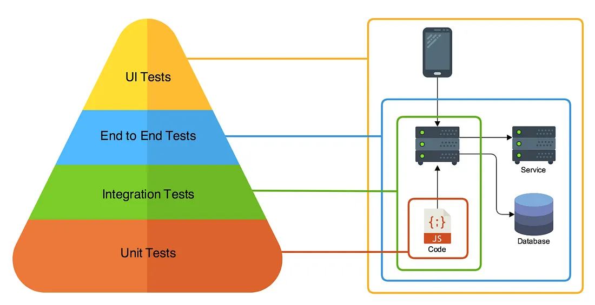
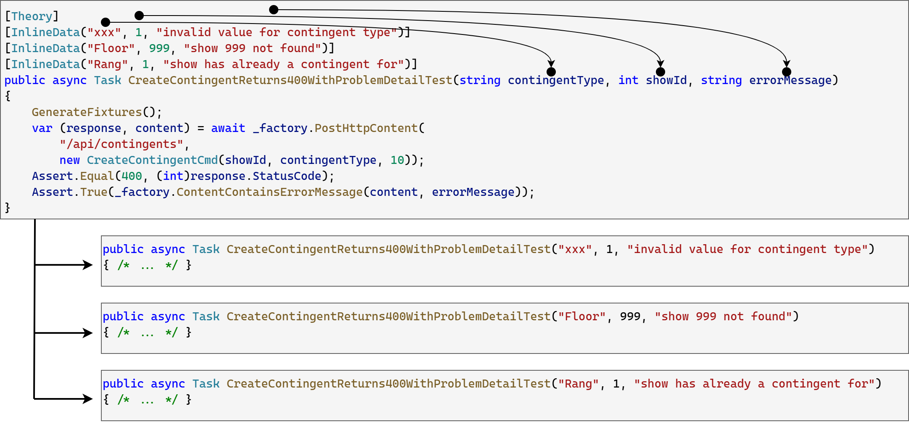

= Integration Tests mit ASP.NET Core
:source-highlighter: rouge
:icons: font
:lang: DE
:hyphens:
:figure-caption!:
ifndef::env-github[:icons: font]
ifdef::env-github[]
:caution-caption: :fire:
:important-caption: :exclamation:
:note-caption: :paperclip:
:tip-caption: :bulb:
:warning-caption: :warning:
endif::[]

== Die Testpyramide

Bisher haben wir Unittests kennengelernt.
Sie prüfen, ob eine Methode ein definiertes Verhalten zeigt.
Der Test läuft auf Codeebene ab, d. h. eine Klasse wird instanziert, die Methode aufgerufen und das Ergebnis wird verglichen.
Das Triple A Schema (Arrange - Act - Assert) ist hier zu erwähnen.

Diese Testart kann allerdings nicht alles prüfen.
In ASP.NET Core haben wir z. B. mittels Attributes das Routingsystem definiert, und mit dem Serviceprovider werden abhängige Klassen zur Verfügung gestellt.
Ein reines Instanzieren der Controllerklasse und überprüfen der Methode deckt keine Fehler in diesem Bereich auf.
Wir brauchen also höherwertige Tests:

.Quelle: https://medium.com/@nathankpeck/microservice-testing-introduction-347d2f74095e

Der *Ingetration Test* ist - technisch gesehen - ein Unittest, der folgenden Ablauf hat:

* Eine Datenbank wird für die Verwendung vorbereitet.
* Ein Testserver wird gestartet.
  Der Serviceprovider wird so angepasst, dass er auf die Testdatenbank verweist.
* Ein HTTP Request wird an den Testserver gesandt.
* Die Antwort des Servers wird ausgewertet.

Das Schema _Arrange - Act - Assert_ ist auch hier erkennbar.

== Integration Tests mit ASP.NET Core

=== Das Paket _Microsoft.AspNetCore.Mvc.Testing_

Die obigen Punkte erfordern einiges an Vorbereitung.
Der Testserver soll automatisiert mit dem Unittest gestartet werden und einen zufälligen, freien Port belegen.
Microsoft stellt mit dem Paket _Microsoft.AspNetCore.Mvc.Testing_ die Klasse _WebApplicationFactory_ bereit, die diese Aufgaben erledigt.
Sie ist als _Basisklasse_ für eine eigene Implementierung gedacht und besitzt die zentrale Methode _ConfigureWebHost_.
Als _virtual_ Methode kann sie überschrieben werden.

Folgende Implementierung einer eigenen Testklasse _TestWebApplicationFactory_ zeigt den Einsatz.

[source,csharp]
----
public class TestWebApplicationFactory<Tcontext> : WebApplicationFactory<Program> where Tcontext : DbContext
{
    private readonly JsonSerializerOptions _jsonOptions = new()
    {
        PropertyNameCaseInsensitive = true
    };

    protected override void ConfigureWebHost(IWebHostBuilder builder)
    {
        builder.ConfigureServices(services =>
        {
            var descriptor = services.First(d => d.ServiceType == typeof(DbContextOptions<Tcontext>));
            services.Remove(descriptor);
            services.AddDbContext<Tcontext>(options =>
            {
                options.UseSqlite("DataSource=api_test.db");
            });
            /* ... */
        });
        builder.UseEnvironment("Testing");
    }
}
----

Die Klasse ist generisch und hat den Typparameter _Tcontext_.
Später wird mit _new TestWebApplicationFactory<EventContext>()_ ein konkreter Datenbankkontext als Typ übergeben.
Den Typparameter kann man sich wie _Bearbeiten -> Ersetzen_ in einem Editor vorstellen.
C# ersetzt den Parameter _Tcontext_ durch _EventContext_.
Damit nicht jede Klasse mit der _TestWebApplicationFactory_ verwendet werden kann, schränken wir den Typ mit _where Tcontext : DbContext_ auf Klassen, die von _DbContext_ erben, ein.

In _ConfigureWebHost_ wird nun der Serviceprovider abgeändert.
Der Testserver startet zunächst mit den in der Datei _Program.cs_ definierten Services.
Danach suchen wir einzelne Services und tauschen sie aus bzw. entfernen diese.
So können wir erreichen, dass die Datenbank nun auf die SQLite Datenbank _api_test.db_ verweist.

=== Die Klasse _TestWebApplicationFactory_

In link:../Eventmanager/Eventmanager.Test/TestWebApplicationFactory.cs[🔗 TestWebApplicationFactory.cs] gibt es eine Implementierung, die auch bei Prüfungen zur Verfügung steht.
Sie hat folgende Methoden, die wir danach in unseren Integration Tests nutzen:

void InitializeDatabase(Action<Tcontext> action)::	
+
Initialisiert die Datenbank mit einer vorgegebenen Methode.
Da wir über den Serviceprovider auf die Datenbank zugreifen müssen, führt diese Methode folgende Schritte vor der Ausführung der übergebenen Funktion durch:
+
* Laden des Datenbankservices über den Service Provider.
* Löschen und neu Erstellen der Datenbank.
+
Konkret wird diese Methode z. B. so verwendet:
[source,csharp]
----
_factory.InitializeDatabase(db =>
{
    var @event = new Event("Event1");
    var show = new Show(@event, new DateTime(2026, 3, 7, 14, 0, 0, DateTimeKind.Utc));
    var contingent = new Contingent(show, ContingentType.Rang, 10);
    db.AddRange(show, contingent);
    db.SaveChanges();
});    
----

Tout QueryDatabase<Tout>(Func<Tcontext, Tout> query)::
+
Erlaubt das Abfragen der Datenbank durch den DbContext.
Die Methode ruft das Service aus dem Service Provider ab und führt die übergebene Methode aus.
+
Konkret wird diese Methode z. B. so verwendet:
[source,csharp]
----
var contingentFromDb = _factory.QueryDatabase(db => db.Contingents.First(c => c.Id == 2));
----

Task<(HttpResponseMessage, T?)> GetHttpContent<T>(string requestUrl) where T : class::
Task<(HttpResponseMessage, JsonElement)> GetHttpContent(string requestUrl)::
+
Sendet einen GET Request an die angegebene Adresse.
Die Adresse muss keine Domain beinhalten, da der Port dynamisch zugewiesen wird.
Wenn ein typisiertes Ergebnis geliefert wird, kann die DTO Klasse bzw. eine Liste der DTO Klasse als Typparameter angegeben werden.
Wird kein Typparameter angegeben, wird ein JSON Element, also die "rohe" JSON Antwort, geliefert.
Die Methode liefert ein Tupel aus 2 Elementen zurück.
+
Konkret wird diese Methode z. B. so verwendet:
[source,csharp]
----
var (response, content) = await _factory.GetHttpContent<ContingentDto>("/api/contingents/1");
----

In _response_ ist die _HttpResponseMessage_ gespeichert.
Sie beinhaltet den Status Code und andere Header Informationen.
In _content_ werden die eigentlichen Daten gespeichert.
Da wir einen Typparameter (_ContingentDto_) angegeben haben, hat diese Variable den Typ _ContingentDto?_.

Task<(HttpResponseMessage, JsonElement)> PostHttpContent<Tcmd>(string requestUrl, Tcmd payload) where Tcmd : class::
Task<(HttpResponseMessage, JsonElement)> PutHttpContent<Tcmd>(string requestUrl, Tcmd payload) where Tcmd : class::
Task<(HttpResponseMessage, JsonElement)> PatchHttpContent<Tcmd>(string requestUrl, Tcmd payload) where Tcmd : class::
+
Sendet einen POST, PUT oder PATCH Request.
Der Parameter _requestUrl_ ist wieder die Adresse.
Der Parameter _paylad_ ist die Instanz eines command objects.
+
Konkret wird diese Methode z. B. so verwendet:
[source,csharp]
----
var (response, content) = await _factory.PostHttpContent(
    "/api/contingents",
    new CreateContingentCmd(1, "Floor", 10));
----

Task<(HttpResponseMessage, JsonElement)> DeleteHttpContent(string requestUrl)::
+
Sendet einen DELETE Request.
Der Parameter _requestUrl_ ist wieder die Adresse.
+
Konkret wird diese Methode z. B. so verwendet:
[source,csharp]
----
var (response, content) = await _factory.DeleteHttpContent("/api/contingents/1");
----

bool ContentContainsErrorMessage(JsonElement content, string message)::
+
Prüft, ob eine problem detail Antwort eine definierte Fehlermeldung enthält.
Die RFC problem detail kann 2 Formen haben.
+
* _{ "detail": "Error message" }_ wenn mit _return Problem(...)_ gearbeitet wurde.
* _{ "errors": "MyProperty": ["Validation message" ] }_ wenn Validierungsfehler auftreten.
+
Es werden Teilstrings verglichen (nicht case sensitive), d. h. _not found_ ist für alle Fehlermeldungen zugreffend, die _not found_ in der Fehlermeldung in _detail_ oder in _errors_ haben.

=== Parametrisierte Tests

Wenn wir z. B. die Fehlerzustände eines Controllers prüfen möchten, und nicht für jeden Fehler einen eigenen Test schreiben möchten, helfen _parametrisierte Tests_.
Sie werden mit _Theory_ definiert.
In _InlineData_ werden die Argumente angegeben, die dann vom Testframework übergenen werden.
In diesem Beispiel werden 3 Unittests generiert und ausgeführt:

[NOTE]
====
Es können nicht alle Datentypen in _InlineData_ angegeben werden.
Braucht man z. B. einen _DateTime_ Wert als Parameter, muss man diesen als String z. B. mit "2026-03-07T16:57:00" definieren, als String im Argument der Testmethode übergeben und mit _DateTime.Parse()_ im Test parsen.
====

=== Konkrete Verwendung im Integration Test

In link:../Eventmanager/Eventmanager.Test/ContingentsControllerTests.cs[🔗 ContingentsControllerTests.cs] werden alle Methoden eines Controllers getestet.
