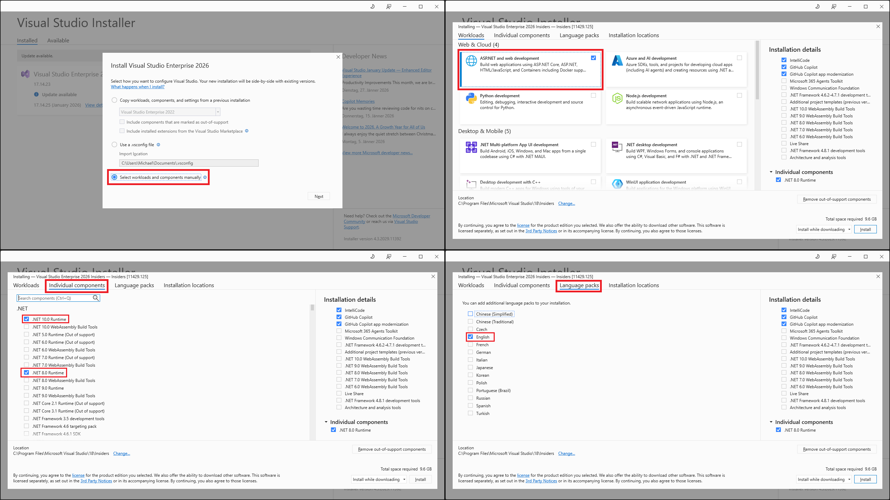
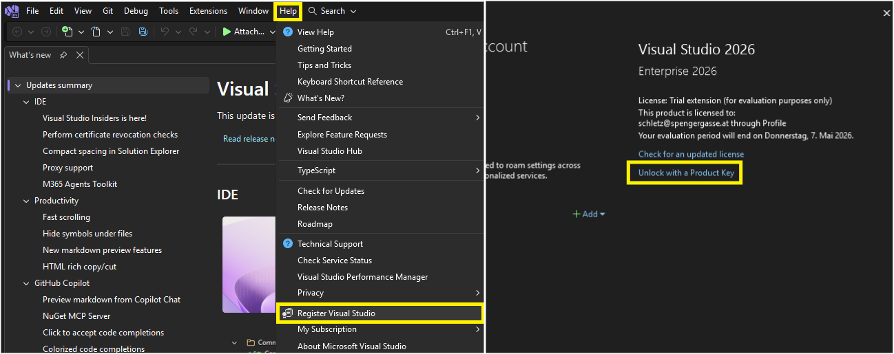

# ASP.NET Core

## Inhalt

Mit ⊛ gekennzeichnete Kapitel sind Erweiterungskapitel.

### Controller und Services in ASP.NET Core

- [RESTful APIs](./01_Rest/README.adoc)
- [Die erste ASP.NET Core App](./02_ASP_Intro/README.adoc)
- [Controller in ASP.NET Core: GET Routen](./03_Get_Routes/README.adoc)
- [POST Routen, Services und Validierung](./04_Post_Routes/README.adoc)
- [PUT, PATCH und DELETE](./05_Put_Patch_Delete_Routes/README.adoc)

### Testen

- [Integration Tests mit ASP.NET Core](./10_Integration_Tests/README.adoc)
- ⊛ [Mocking mit NSubstitute](./11_Mocking/README.adoc)

### Installation von Visual Studio 2026

Lade von https://visualstudio.microsoft.com/de/downloads/ die *Enterprise* Version von Visual Studio 2026 herunter.
Falls du unter macOS arbeitest, stelle sicher, dass du die neueste Rider Installation besitzt, die .NET 10 unterstützt.

Wähle im Installer den Workload *ASP.NET* and web development_ aus.
Installiere unter *Individual options* zusätzlich die .NET 8 Runtime, um ältere Projekte ausführen zu können.
Unter *Language packs* wähle das englische Sprachpaket.

Starte nach der Installation Visual Studio 2026.
Du kannst mit *Help* - *Register Visual Studio* den Key eingeben.

