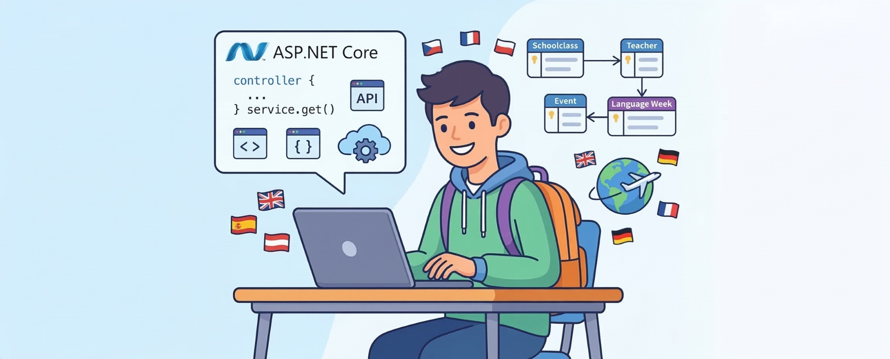
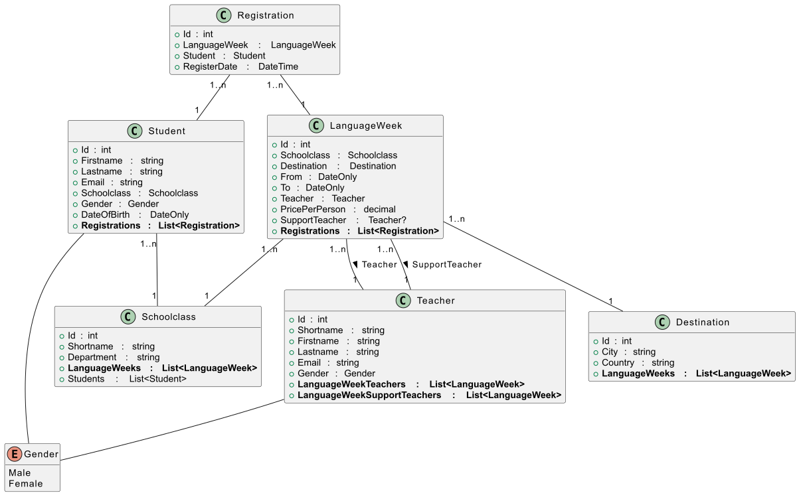

= Übungsprüfung zu Services und ASP.NET Core (HIF): Verwaltung von Sprachwochen
:source-highlighter: rouge
:icons: font
:lang: DE
:hyphens:
ifndef::env-github[:icons: font]
ifdef::env-github[]
:caution-caption: :fire:
:important-caption: :exclamation:
:note-caption: :paperclip:
:tip-caption: :bulb:
:warning-caption: :warning:
endif::[]

Laden Sie die Datei link:Languageweek.7z[→ Languageweek.7z] und entpacken Sie sie.
Sie brauchen das .NET 10 SDK und eine damit kompatible IDE wie Visual Studio 2026.
Führen Sie im Verzeichnis der sln Datei die folgenden Befehle aus, um die Pakete zu laden und die SDK zu prüfen:

----
dotnet restore --no-cache
dotnet build
----

Öffnen Sie danach die Datei _Languageweek.sln_ in der bevorzugten IDE.

== Domain Model

Das Modell bildet eine vereinfachte Verwaltung von Sprachwochen ab.
Eine Sprachwoche (_LanguageWeek_) wird für eine bestimmte Klasse (_Schoolclass_) angelegt.
Es gibt immer einen Lehrer, der die Veranstaltung leitet (_Languageweek.Teacher_).
Optional kann ein Begleitlehrer mitfahren (_Languageweek.SupportTeacher_).
Die Ziele (_Destination_) sind zentral in der Datenbank vorgegeben.
Schülerinnen und Schüler können sich zur Sprachwoche anmelden.
Für eine Anmeldung wird eine _Registration_ geschrieben, die das Anmeldedatum beinhaltet.

Das UML Diagramm sieht so aus:

== Aufgabe 1: Abfragen

In _Languageweek.Application/Infrastructure/LanguageweekContext.cs_ gibt es 4 Abfragemethoden, die Sie implementieren müssen:

`List<Teacher> GetTeachersWithMinCountOfParticipations(int count)`::
Diese Methode soll ermitteln, welche Lehrer mindestens _count_ mal bei einer Sprachwoche als Leiter oder Begleiter eingesetzt werden.
Tipp: Verwenden Sie die Navigations _LanguageweekTeachers_ und _LanguageweekSupportTeachers_.
Vergleichem Sie mit ≥ count.

`List<Schoolclass> GetClassesWithoutLanguageWeek()`::
Diese Methode soll ermitteln, welche Klassen _nie_ für eine Sprachreise verplant wurden.

`List<SchoolclassStatistics> CalcSchoolclassStatistics()`::
Diese Methode soll ermitteln, wie viele männliche und weibliche Schüler es pro Klasse gibt.
Als Rückgabe steht Ihnen folgender Record zur Verfügung:
+
[source,csharp]
----
public record SchoolclassStatistics(
    int Id, string Shortname, int MaleCount, int FemaleCount);
----

`List<LanguageWeekRegistrationRate> CalcRegistrationRates()`::
Diese Methode soll eine Statistik für jede Sprachwoche berechnen.
Als Rückgabe steht Ihnen folgender Record zur Verfügung:
+
[source,csharp]
----
public record LanguageWeekRegistrationRate(
    int Id, DateOnly From, DateOnly To, decimal TotalPrice,
    int DestinationId, string DestinationCity, string DestinationCountry,
    int SchoolclassId, string SchoolclassShortname, decimal Percentage);
----
+
Das Property _TotalPrice_ berechnet sich aus Teilnehmeranzahl (Anzahl der _Registrations_ der Sprachwoche) mal _PricePerPerson_.
Das Property _Percentage_ berechnet sich aus der Teilnehmeranzahl in Relation zur Gesamtzahl der SchülerInnen der betreffenden Klasse in Prozent.
Runden Sie diesen Prozentwert auf 1 Dezimalstelle mit _Math.Round()_.

=== Testen der Implementierung

In _Languageweek.Test/LanguageweekContextTests.cs_ stehen vordefinierte Tests zur Verfügung, die die Richtigkeit Ihrer Implementierung testen.

== Aufgabe 2: Service

In _Languageweek.Application/Services/LanguageweekService.cs_ sollen 4 Methoden implementiert werden:

`Task<LanguageWeek> CreateLanguageWeekAsync(CreateLanguageWeekCommand command)`::
Diese Methode soll eine Sprachwoche anlegen.
Als command object dient folgender Record:
+
[source,csharp]
----
public record CreateLanguageWeekCommand(
    int SchoolclassId, int DestinationId, DateOnly From, DateOnly To,
    int TeacherId, decimal PricePerPerson);
----
+
Folgende Prüfungen sollen in der Businesslogik vorgenommen werden:
+
*(1)* Wird die ID der Schulklasse nicht gefunden, ist _throw new LanguageweekServiceException("Klasse nicht gefunden.")_ zu werfen. +
*(2)* Wird die ID des Reisezieles (Destination) nicht gefunden, ist _throw new LanguageweekServiceException("Reiseziel nicht gefunden.")_ zu werfen. +
*(3)* Wird die ID des Lehrers nicht gefunden, ist _throw new LanguageweekServiceException("Lehrer nicht gefunden.")_ zu werfen. +
*(4)* Es darf eine Klasse nur einmal auf Sprachreise fahren.
      Ist die Klasse schon in _Languageweeks_ vorhanden, ist _throw new LanguageweekServiceException("Die Klasse hat bereits eine Sprachwoche geplant.")_ zu werfen. +
*(5)* Bei Lehrern darf es natürlich nicht zu Überschneidungen kommen.
      Ist ein Lehrer in diesem Zeitraum schon als Leiter oder Begleiter im Einsatz, 
      ist _throw new LanguageweekServiceException("Der Lehrer ist in diesem Zeitraum bereits auf einer anderen Sprachwoche.")_ zu werfen.
      Das folgende Bild zeigt, wie geprüft werden kann, ob eine Überschneidung vorliegt.
+
image::time_intervals_0956.png[width=50%,align="center"]
+
Werden alle Bedingungen erfüllt, ist der Datensatz in der Datenbank zu speichern und zurückzugeben.

`Task UpdateLanguageWeekAsync(UpdateLanguageWeekCommand command)`::
Diese Methode soll eine Sprachwoche aktualisieren.
Als command object dient folgender Record:
+
[source,csharp]
----
public record UpdateLanguageWeekCommand(
    int Id, int DestinationId, DateOnly From, DateOnly To,
    int TeacherId, decimal PricePerPerson);
----
+
Die Klasse darf nicht verändert werden, deswegen ist sie auch nicht in _UpdateLanguageWeekCommand_ enthalten.
+
Folgende Prüfungen sollen in der Businesslogik vorgenommen werden:
+
*(1)* Wird die ID der Sprachwoche nicht gefunden, ist _throw new LanguageweekServiceNotFoundException("Sprachwoche nicht gefunden.")_ zu werfen. +
*(2)* Die anderen Parameter werden wie in _CreateLanguageWeekAsync_ geprüft.
+
Werden alle Bedingungen erfüllt, ist der Datensatz in der Datenbank zu aktualisieren.
+
Hinweis: Die Prüfschritte sind weitgehend ident mit _CreateLanguageWeekAsync_.
Stellen Sie durch Methoden sicher, dass es nicht zu Codeduplizierungen kommt.

`Task UpdateLanguageWeekPriceAsync(UpdateLanguageWeekPriceCommand command)`::
Diese Methode soll den Preis einer Sprachwoche aktualisieren.
Als command object dient folgender Record:
+
[source,csharp]
----
public record UpdateLanguageWeekPriceCommand(int Id, decimal PricePerPerson);
----
+
Wird die Sprachwoche nicht gefunden, ist _throw new LanguageweekServiceNotFoundException("Sprachwoche nicht gefunden.")_ zu werfen.

`Task DeleteLanguageWeekAsync(int id, bool forceDelete = false)`::
Diese Methode soll eine Sprachwoche löschen.
+
Folgende Prüfungen sollen in der Businesslogik vorgenommen werden:
+
*(1)* Wird die ID der Sprachwoche nicht gefunden, ist _throw new LanguageweekServiceNotFoundException("Sprachwoche nicht gefunden.")_ zu werfen. +
*(2)* Vergangene Sprachwochen dürfen nicht gelöscht werden, auch nicht mit _forceDelete_.
      Werfen Sie in diesem Fall mit _throw new LanguageweekServiceException("Vergangene Sprachwochen dürfen nicht gelöscht werden.")_
      eine Exception.
      Beziehen Sie die Systemzeit über den bereitgestellten _TimeProvider_ mit _timeProvider.GetUtcNow().DateTime_.
      Hinweis: Mit _DateOnly.FromDateTime()_ können Sie einen _DateTime_ Wert in einen _DateOnly_ Wert umwandeln. +
*(3)* Wenn Schüler angemeldet sind (Daten in _Registrations_ zu dieser Sprachwoche vorhanden sind), und der Parameter _forceDelete_ auf _false_ gesetzt ist, ist
      _throw new LanguageweekServiceException("Die Sprachwoche kann nicht gelöscht werden, da bereits Schüler angemeldet sind.")_ zu werfen.
+
Werden alle Bedingungen erfüllt, ist der Datensatz in der Datenbank zu löschen.
Gegebenenfalls müssen, wenn _forceDelete_ gesetzt ist, vorher alle Anmeldungen (_Registrations_) gelöscht werden.

=== Testen der Implementierung

In _Languageweek.Test/LangugageServiceTests.cs_ stehen vordefinierte Tests zur Verfügung, die die Richtigkeit Ihrer Implementierung testen.

== Aufgabe 3: Controller

In _Languageweek.Api/Controllers/LanguageweeksController.cs_ sollen Endpunkte für die Servicemethoden implementiert werden.
Der Controller besitzt eine Dependency über das Interface _ILanguageweekService_ zum Service.
*Der Controller darf nicht direkt auf den Datenbankcontext zugreifen.*
Stellen Sie erforderlichenfalls DbSets mit _AsQueryable()_ zur Verfügung und ergänzen das Interface.

`GET api/languageweeks?includeRegistrations=(true|false)`::
Dieser Endpunkt liefert eine Liste aller Sprachwochen (_LanguageWeekWithRegistrationsDto_) zurück.
Als DTO steht Ihnen folgender record zur Verfügung:
+
[source,csharp]
----
public record LanguageWeekWithRegistrationsDto(
    int Id, DateOnly From, DateOnly To, decimal PricePerPerson,
    string SchoolclassShortname, string DestinationCity, string TeacherShortname,
    List<RegistrationDto> Registrations);

public record RegistrationDto(
    DateTime RegisterDate, int StudentId, string StudentFirstname,
    string StudentLastname, string StudentEmail);
----
Ist der Parameter _includeRegistrations_ nicht gesetzt oder ist _false_, ist in _Registrations_ eine leere Liste zu liefern.
Ist der Parameter _true_, so ist in Registrations die Liste aller Teilnehmer zu liefern.

`GET api/languageweeks/{id}`::
Dieser Endpunkt liefert Details zu einer Sprachwoche mit der übergebenen ID zurück.
Als DTO steht Ihnen folgender record zur Verfügung:
+
[source,csharp]
----
public record LanguageWeekDto(
    int Id, DateOnly From, DateOnly To, decimal PricePerPerson,
    string SchoolclassShortname, string DestinationCity, string TeacherShortname);
----
+
Wird die ID nicht in der Datenbank gefunden, ist HTTP 404 not found samt problem detail body mit der Meldung _Sprachwoche nicht gefunden._ zurückzugeben.

`POST api/languageweeks`::
Legt eine neue Sprachwoche über die Servicemethode _CreateLanguageWeekAsync_ an.
Im Erfolgsfall soll HTTP 201 created mit der ID der neuen Sprachwoche geliefert werden.
Der Location Header soll auf die URL der neu angelegten Ressource zeigen.
+
Als command object steht Ihnen folgender Record zur Verfügung:
+
[source,csharp]
----
public record CreateLanguageWeekCommand(
    int SchoolclassId, int DestinationId, DateOnly From, DateOnly To,
    int TeacherId, decimal PricePerPerson);
----
+
Stellen Sie durch Validation Attributes des command objects bzw. Implementierung des Interfaces _IValidatableObject_ sicher, dass +
*(1)* _SchoolclassId_ mindestens den Wert 1 hat. +
*(2)* _DestinationId_ mindestens den Wert 1 hat. +
*(3)* _TeacherId_ mindestens den Wert 1 hat. +
*(4)* _PricePerPerson_ nur Werte zwischen 0.01 und 10000 besitzt. +
*(5)* Ist _From_ in der Vergangenheit, liefern Sie die Validierungsmeldung _Der Start der Sprachwoche muss in der Zukunft liegen._ 
      Hinweis: Verwenden Sie _validationContext.GetRequiredService<TimeProvider>()_, um den _TimeProvider_ abzurufen. +
*(6)* Ist das Ende (_To_) kleiner oder gleich _From_, liefern Sie die Validierungsmeldung _Das Enddatum muss nach dem Startdatum liegen._
+
Bei Fehlern des Services ist HTTP 400 samt problem detail body zu liefern.

`PUT api/languageweeks/{id}`::
Aktualisiert eine bestehende Sprachwoche mit der Servicemethode _UpdateLanguageWeekAsync_.
Im Erfolgsfall soll HTTP 204 no content geliefert werden.
+
Als command object steht Ihnen folgender Record zur Verfügung:
+
[source,csharp]
----
public record UpdateLanguageWeekCommand(
    int Id, int DestinationId, DateOnly From,
    DateOnly To, int TeacherId, decimal PricePerPerson
);
----
+
Stellen Sie durch Validation Attributes des command objects bzw. Implementierung des Interfaces _IValidatableObject_ sicher, dass +
*(1)* _Id_ mindestens den Wert 1 hat. +
*(2)* _PricePerPerson_ nur Werte zwischen 0.01 und 10000 besitzt. +
+
Wird eine Sprachwoche nicht gefunden, ist HTTP 404 not found zu liefern.
Achten Sie deshalb darauf, dass Sie bei _LanguageweekServiceNotFoundException_ den korrekten Status zurückgeben.
Bei anderen Fehlern des Services ist HTTP 400 samt problem detail body zu liefern.

`PATCH api/languageweeks/{id}/price`::
Aktualisiert den Preis einer bestehenden Sprachwoche mit der Servicemethode _UpdateLanguageWeekPriceAsync_.
Im Erfolgsfall soll HTTP 204 no content geliefert werden.
+
Als command object steht Ihnen folgender Record zur Verfügung:
+
[source,csharp]
----
public record UpdateLanguageWeekPriceCommand(int Id, decimal PricePerPerson);
----
+
Stellen Sie durch Validation Attributes des command objects bzw. Implementierung des Interfaces _IValidatableObject_ sicher, dass +
*(1)* _Id_ mindestens den Wert 1 hat. +
*(2)* Die Validierungsregeln der restlichen Felder wie _DestinationId_, _From_, _To_, ... sollen wie im POST Endpunkt implementiert werden.
+
Wird eine Sprachwoche nicht gefunden, ist HTTP 404 not found zu liefern.
Achten Sie deshalb darauf, dass Sie bei _LanguageweekServiceNotFoundException_ den korrekten Status zurückgeben.
Bei anderen Fehlern des Services ist HTTP 400 samt problem detail body zu liefern.

`DELETE api/languageweeks/{id}?forceDelete=(true|false)`::
Löscht eine Sprachwoche mit der Servicemethode _DeleteLanguageWeekAsync_.
+
Wird eine Sprachwoche nicht gefunden, ist HTTP 404 not found zu liefern.
Achten Sie deshalb darauf, dass Sie bei _LanguageweekServiceNotFoundException_ den korrekten Status zurückgeben.
Bei anderen Fehlern des Services ist HTTP 400 samt problem detail body zu liefern.

== Aufgabe 4: Integration Tests mit Mocking des Services

In _Languageweek.Test/MockingTests.cs_ steht Ihnen eine leere Klasse _MockingTests_ bereit, in der Sie alle Endpunkte mit einem Mock des Services testen sollen.
Testen Sie den _LanguageweekController_ mit 100% code coverage.
Sie können die bereitgestellte Klasse _TestWebApplicationFactory_ verwenden, um einen Mock des Services zu registrieren und Requests abzusetzen.
