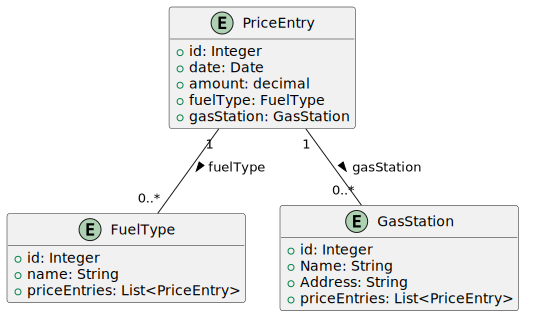

= PLF in Programmieren und Software Engineering
:source-highlighter: rouge
:icons: font
:pdf-page-header: true
:lang: DE
:hyphens:
:figure-caption!:
ifndef::env-github[:icons: font]
ifdef::env-github[]
:caution-caption: :fire:
:important-caption: :exclamation:
:note-caption: :paperclip:
:tip-caption: :bulb:
:warning-caption: :warning:
endif::[]

____
[.lead]
Klasse: 8ABIF und 8ACIF +
Datum: MI, 15. April 2026 +
Arbeitszeit: 3 UE
____

== Wichtiger Hinweis vor Arbeitsbeginn

Auf dem Laufwerk _Z_ finden Sie die Datei _link:Plf8abifcif_20260415.7z[Plf8abifcif_20260415.7z]_.
Klicken Sie mit der rechten Maustaste auf die Datei und wählen Sie _Weitere Optionen_ -> _7-Zip_ -> _Extract here_.
Gehen Sie dann in den Ordner _Plf8abifcif_ und starten Sie die Datei _start_solution.cmd_.
Diese Datei lädt zuerst alle Dependencies aus dem Internet und startet dann das Projekt in diesem Ordner.
Sie müssen das Programm nicht abgeben, denn Sie arbeiten direkt am Netzlaufwerk.

[WARNING]
====
Füllen Sie die Datei _README.md_ in _Plf8abifcif/README.md_ mit Ihren Daten (Klasse, Name und Accountname) aus.
*Falls Sie dies nicht machen, kann Ihre Arbeit nicht zugeordnet und daher nicht bewertet werden!*
====

[WARNING]
====
Während der Prüfung ist der Internetzugriff gesperrt.
Für Visual Studio: Führen Sie niemals _Build_ -> _Rebuild Solution_ aus, denn dadurch werden die lokalen Pakete gelöscht.
Arbeiten Sie immer mit _Build_ -> _Build Solution_ (F6).
====

== Domain Model (alle Aufgaben)

Durch die aktuellen Ereignisse wird der Benzinpreis an den Tankstellen häufig diskutiert.
Ein kleines Domain Model erlaubt die Speicherung von Tankstellen (_GasStation_), Treibstoffarten (_FuelType_) und der täglichen Preise für diese Tankstelle und Treibstoffart (_PriceEntry_).

.link:https://www.plantuml.com/plantuml/uml/dP1FIyGm4CNl-HH3ZiekUWsohE0V115X_G9nywm3dTcIJ0z5_EvMGhS5wSKS0lE3UM_UsnUBsNfftISd4AIpWGJoZbmSr7WS7tgqRqC7-d8qlajEWPxKq21Ne54Gw62PjQcaotp4lOu49T0p5xjvdT2mSzzkqdwCvM3H-AIhwYz_r6zJoYZbdvOpNRLCqH3eRlph7ENKgmLAEBB4jiAFMWl2kQ3ActEai8ZtUy32sLzxscp8Nsst5txPGY2_erd2hozDhdLbkiQxFJJrqlu0[PlantUML source]

Die Daten in _PriceEntry_ sind lückenlos, d. h. es ist für jeden Tag und jede Treibstoffart der Tankstelle ein Datensatz vorhanden.
In _amount_ ist der Betrag pro Liter in Euro gespeichert.

Beim Programmstart wird eine Musterdatenbank mit 3 Tabellen angelegt und befüllt.

.Tabelle fuelType
[%header,cols="a,9a"]
|===
|id
|name

|1
|Super95

|2
|Super98

|3
|Diesel
|===

.Tabelle gasStation
[%header,cols="1a,4a,4a"]
|===
|id
|name
|address

|1
|Shell
|Solinger Str. 53, West Maximaburg

|2
|Shell
|Hütte 78c, Bad Eleni

|3
|BP
|Mülheimer Str. 80b, Benediktstadt
|===

.Tabelle priceEntry (Auszug)

Für jeden Tag wird ein Eintrag in _PriceEntry_ erstellt.
[%header,cols="a,a,a,a,a"]
|===
|id
|date
|amount
|fuelTypeId
|gasStationId

|1
|2026-01-01
|1.7286
|1
|1

|2
|2026-01-01
|1.9615
|2
|1

|3
|2026-01-01
|1.8637
|3
|1

|304
|2026-01-01
|1.7441
|1
|2

|305
|2026-01-01
|1.9066
|2
|2

|306
|2026-01-01
|1.8702
|3
|2

|610
|2026-01-01
|1.671
|1
|3

|611
|2026-01-01
|1.8917
|2
|3

|612
|2026-01-01
|1.8772
|3
|3

|4
|2026-01-02
|1.8545
|1
|1

|5
|2026-01-02
|2.0306
|2
|1

|6
|2026-01-02
|1.8865
|3
|1
|===

== Aufgabe 1: Abfragen und Servicemethoden (14 Punkte)

Im Projekt _Aufgabe1_ befindet sich die Klasse _PriceService_.
Alle folgenden Implementierungen finden in dieser Klasse statt.

Es sind folgende Abfragen und Servicemethoden zu implementieren:

=== decimal CalcAveragePrices(DateOnly dateFrom, DateOnly dateTo, string fuelTypeName, int gasStationId)

Berechnen Sie den Durchschnittspreis für eine Treibstoffart einer bestimmten Tankstelle in einem Zeitbereich.
Die Tage in _dateFrom_ und _dateTo_ sind inklusive, d. h. vergleichen Sie mit `>=` bzw. `\<=`.

Hinweis: Verwenden Sie die Funktion _Average(fieldExpression)_ (C#) bzw. _average()_ (Java) für die Berechnung des Durchschnitts.

=== PriceDto GetPrices(DateOnly date, int gasStationId)

Geben Sie die Preise für die Treibstoffarten _Super95_, _Super98_ und _Diesel_ an einem bestimmten Tag an einer bestimmten Tankstelle zurück.
Die Namen der Treibstoffarten sind in _FuelType.Name_ gespeichert.
Falls es keine Einträge für eine Treibstoffart an diesem Tag an dieser Tankstelle gibt, geben Sie _null_ im entsprechenden Feld als Preis zurück.
Als Rückgabetyp steht Ihnen folgender Record zur Verfügung:

[source,csharp]
----
public record PriceDto(
  DateOnly date, decimal? Super95Price, decimal? Super98Price, decimal? DieselPrice);
----

=== void AddPriceEntry(int gasStationId, DateOnly date, string fuelTypeName, decimal price)

Diese Methode soll einen neuen Datensatz in _PriceEntry_ erstellen.
Dabei sind folgende Randbedingungen zu prüfen:

* Wird die übergebene _gasStationId_ nicht gefunden, werfen Sie mit _throw new PriceServiceException("Invalid gas station.")_ eine Exception.
* Wird der übergebene _fuelTypeName_ nicht gefunden, werfen Sie mit _throw new PriceServiceException("Invalid fuel type.")_ eine Exception.
* Es dürfen nur Preise nach dem letzten eingetragenen Datum der betreffenden Tankstelle und der betreffenden Treibstoffart eingetragen werden.
  Beispiel: Es gibt einen Datensatz für den 10.4.2026 an der Tankstelle 1 für _Super95_. Dann dürfen Sie keinen Datensatz für den 9.4.2026 oder 10.4.2026 erstellen.
  Falls doch Datensätze mit einem höheren oder gleichen Datum eingetragen sind, werfen Sie mit _throw new PriceServiceException("There are records for prices at or after the price date.")_ eine Exception.
* Spritpreisregel: Die Preise dürfen nur am _Montag_, _Mittwoch_ oder _Freitag_ erhöht werden.
  Verringerungen sind immer möglich.
  Prüfen Sie daher, bevor Sie den Datensatz einfügen, ob es im Vergleich zum _Vortag_ eine Erhöhung oder Verringerung ist.
  Falls der Preis höher als am Vortag ist, aber das Datum kein _Montag_, _Mittwoch_ oder _Freitag_ ist, werfen Sie mit
  _throw new PriceServiceException("The price can only be increased on Monday, Wednesday or Friday.");_ eine Exception.
  Der Vergleich ist natürlich mit derselben Tankstelle und derselben Treibstoffart durchzuführen.
  Sie können bei Ihrer Implementierung davon ausgehen, dass es immer einen Datensatz vom Vortag für diese Tankstelle und diese Treibstoffart gibt. +
   +
  Hinweis: Sie können mit dem Property _DayOfWeek_ von _DateOnly_ (C#) bzw. mit der Methode _getDayOfWeek()_ von _LocalDate_ (Java) den Wochentag herausfinden.
  Mit _AddDays(-1)_ bzw. _minusDays(1)_ können Sie 1 Tag subtrahieren.

Sind alle Bedingungen erfüllt, speichern Sie den neuen _PriceEntry_-Datensatz in der Datenbank.

=== Durchführen von Tests

In _Aufgabe1.Tests_ sind vordefinierte Unittests für die Servicemethoden vorhanden, die Sie nutzen können.
*Es sind keine Unittests selbst zu implementieren.*

== Aufgabe 2a: Erstellen einer RESTful API (17 Punkte)

Im Projekt _Aufgabe2_ steht Ihnen eine Klasse _GasStationsController_ zur Verfügung.
Diese Klasse bekommt über Dependency Injection ein vorgegebenes Service (_GasStationService_).
*Verwenden Sie dieses vorgegebene Service; Sie müssen nicht Ihren Service von Aufgabe 1 verwenden.*

Das Service hat 3 Methoden bzw. Properties:

`IQueryable<PriceEntry> PriceEntries` bzw. `List<PriceEntry> getPriceEntries()`::
Liefert eine Liste aller in der Datenbank befindlichen Preiseinträge (_PriceEntry_).
Wird für die GET-Methode im Controller verwendet.

`Task<PriceEntry> AddPriceEntry(AddPriceEntryCmd cmd)` bzw. `PriceEntry addPriceEntry(...)`::
Legt ein _PriceEntry_ auf Basis des übergebenen Commands an und gibt dieses zurück.
Wirft _GasStationException_, wenn die Daten nicht eingefügt werden können.

`Task UpdateAddress(UpdateAddressCmd cmd)` bzw. `void updateAddress(...)`::
Aktualisiert die Adresse der Tankstelle auf Basis des übergebenen Commands.
Wirft _GasStationNotFoundException_, wenn die Tankstelle nicht gefunden wurde.
Wirft _GasStationException_, wenn die Daten nicht aktualisiert werden können.

=== GET /api/gasstations/{gasStationId}/price/{priceEntryId}

Dieser Endpunkt liefert ein Objekt mit der angegebenen Id in _PriceEntry.Id_ zurück.
Filtern Sie auch nach der ID der Tankstelle (_gasStationId_).
Nutzen Sie hierfür im vorgegebenen Service das Property _PriceEntries_ (C#) bzw. die Methode _getPriceEntries()_ (Java).
Als Rückgabetyp steht Ihnen folgender Record zur Verfügung:

[source,csharp]
----
public record PriceEntryDto(int Id, string FuelTypeName, DateOnly date, decimal amount);
----

Wird der Preiseintrag der Tankstelle nicht gefunden, ist HTTP 404 Not Found mit RFC Problem Detail zurückzugeben.

=== POST /api/gasstations/{gasStationId}/price

Dieser Endpunkt trägt für eine bestimmte Tankstelle (_gasStationId_) einen neuen Preis ein.
Nutzen Sie hierfür im vorgegebenen Service die Methode _AddPriceEntry_.
Als Command-Object steht Ihnen folgender Record zur Verfügung, den Sie ggf. mit Validierungen ergänzen müssen:

[source,csharp]
----
public record AddPriceEntryCmd(DateOnly Date, decimal Amount, int FuelTypeId, int GasStationId)
----

Achten Sie auf folgende _Validierungen_ des Command-Objekts bzw. des Controllers:

* Der Wert in _gasStationId_ muss mit dem Routing-Parameter übereinstimmen.
* Der Wert in _amount_ (Preis) muss zwischen 1 und 10 sein.
* Der Wert in _fuelTypeId_ muss mindestens 1 sein.
* Der Wert in _gasStationId_ muss mindestens 1 sein.

Wird eine dieser Bedingungen verletzt, geben Sie HTTP 400 (Bad Request) samt RFC Problem Detail zurück.
Wurde der Datensatz korrekt angelegt, geben Sie HTTP 201 (Created) mit korrektem Location-Header auf den entsprechenden GET-Endpunkt _/api/gasstations/{gasStationId}/price/{priceEntryId}_ zurück.

=== PATCH /api/gasstations/{gasStationId}/address

Ändert die Adresse einer Tankstelle.
Als Command-Object steht Ihnen folgender Record zur Verfügung, den Sie ggf. mit Validierungen ergänzen müssen:

[source,csharp]
----
public record UpdateAddressCmd(int GasStationId, string Address);
----

Achten Sie auf folgende _Validierungen_ des Command-Objekts bzw. des Controllers:

* Der Wert in _gasStationId_ muss mit dem Routing-Parameter übereinstimmen.
* Der Wert in _gasStationId_ muss mindestens 1 sein.
* Der String in _address_ muss zwischen 1 und 255 Stellen lang sein.

Wird eine dieser Bedingungen verletzt, geben Sie HTTP 400 (Bad Request) samt RFC Problem Detail zurück.
Wird die Tankstelle nicht in der Datenbank gefunden, geben Sie HTTP 404 (Not Found) samt RFC Problem Detail zurück.
Wurde der Datensatz korrekt aktualisiert, geben Sie HTTP 204 (No Content) zurück.

=== HTTP-File zum Testen Ihrer Implementierung

In der Datei _Aufgabe2.http_ im Projekt _Aufgabe2_ steht Ihnen ein HTTP-File zur Verfügung.
Sie können es verwenden, um Ihre Implementierung manuell zu prüfen.

== Aufgabe 2b: Erstellen von End-to-End (Integration) Tests (7 Punkte)

Verfassen Sie im Projekt _Aufgabe2.Test_ in der Klasse _GasStationsControllerTests_ Integration-Tests, die den Endpunkt _POST /api/gasstations/{gasStationId}/price_ testen.
Es sind keine anderen Endpunkte zu testen.

Erstellen Sie Tests für die folgenden Szenarien:

* _POST /api/gasstations/{gasStationId}/price_ kann mit gültigen Daten den Datensatz anlegen und liefert HTTP 201 Created.
  Prüfen Sie, ob der korrekte Statuscode geliefert wird.
* _POST /api/gasstations/{gasStationId}/price_ kann den Datensatz nicht anlegen, da der Routingparameter _gasStationId_ nicht mit dem Wert _gasStationId_ im Command-Objekt übereinstimmt.
  Prüfen Sie, ob der korrekte Statuscode geliefert wird.
* _POST /api/gasstations/{gasStationId}/price_ kann wegen eines ungültigen Werts in _amount_ den Datensatz nicht anlegen und liefert HTTP 400 Bad Request.
  Prüfen Sie, ob der korrekte Statuscode geliefert wird.
* _POST /api/gasstations/{gasStationId}/price_ kann wegen eines ungültigen Werts in _fuelTypeId_ den Datensatz nicht anlegen und liefert HTTP 400 Bad Request.
  Prüfen Sie, ob der korrekte Statuscode geliefert wird.
* _POST /api/gasstations/{gasStationId}/price_ kann wegen eines ungültigen Werts in _gasStationId_ den Datensatz nicht anlegen und liefert HTTP 400 Bad Request.
  Prüfen Sie, ob der korrekte Statuscode geliefert wird.

== Bewertung

[%header,cols="7a,^a"]
|===
|Kriterium
|Punkte

|Die Methode CalcAveragePrices berechnet den Durchschnittspreis korrekt.
|2

|Die Methode GetPrices ermittelt die korrekten Preise.
|2

|Die Methode AddPriceEntry prüft korrekt, ob der Parameter fuelTypeName korrekt ist.
|2

|Die Methode AddPriceEntry prüft korrekt, ob der Parameter gasStationId korrekt ist.
|2

|Die Methode AddPriceEntry prüft korrekt, ob keine Datensätze am oder an nachfolgenden Tagen vorhanden sind.
|2

|Die Methode AddPriceEntry prüft korrekt, ob Erhöhungen nur am MO, MI oder FR stattfinden dürfen.
|2

|Die Methode AddPriceEntry schreibt den Datensatz bei einer Verringerung des Preises korrekt in die Datenbank.
|1

|Die Methode AddPriceEntry schreibt den Datensatz bei einer Erhöhung des Preises korrekt in die Datenbank.
|1

|GET /api/gasstations/{gasStationId}/price/{priceEntryId} liefert die korrekten Daten.
|2

|GET /api/gasstations/{gasStationId}/price/{priceEntryId} liefert HTTP 404, wenn kein priceEntryId für diese Tankstelle gefunden wird.
|1

|POST /api/gasstations/{gasStationId}/price schreibt den Preis in die Datenbank und liefert HTTP 201.
|2

|POST /api/gasstations/{gasStationId}/price liefert im Erfolgsfall den korrekten Location-Header.
|2

|POST /api/gasstations/{gasStationId}/price validiert den Routingparameter korrekt.
|1

|POST /api/gasstations/{gasStationId}/price validiert amount korrekt.
|1

|POST /api/gasstations/{gasStationId}/price validiert fuelTypeId korrekt.
|1

|POST /api/gasstations/{gasStationId}/price validiert gasStationId korrekt.
|1

|PATCH /api/gasstations/{gasStationId}/address aktualisiert die Adresse in der Datenbank und liefert HTTP 204.
|2

|PATCH /api/gasstations/{gasStationId}/address liefert HTTP 404, wenn gasStationId nicht gefunden wurde.
|1

|PATCH /api/gasstations/{gasStationId}/address validiert den Routingparameter korrekt.
|1

|PATCH /api/gasstations/{gasStationId}/address validiert gasStationId korrekt.
|1

|PATCH /api/gasstations/{gasStationId}/address validiert address korrekt.
|1

|Der Integration-Test für den Erfolgsfall von POST /api/gasstations/{gasStationId}/price ist korrekt und läuft durch.
|3

|Der Integration-Test für den Routing-Parameter gasStationId ist korrekt und läuft durch.
|1

|Der Integration-Test für die Validierung von amount ist korrekt und läuft durch.
|1

|Der Integration-Test für die Validierung von fuelTypeId ist korrekt und läuft durch.
|1

|Der Integration-Test für die Validierung von gasStationId ist korrekt und läuft durch.
|1

|Summe
|38
|===

38 - 34 Punkte: Sehr gut, 33 - 29 Punkte: Gut, 28 - 24 Punkte: Befriedigend, 23 - 19 Punkte: Genügend, 18 - 0 Punkte: Nicht genügend